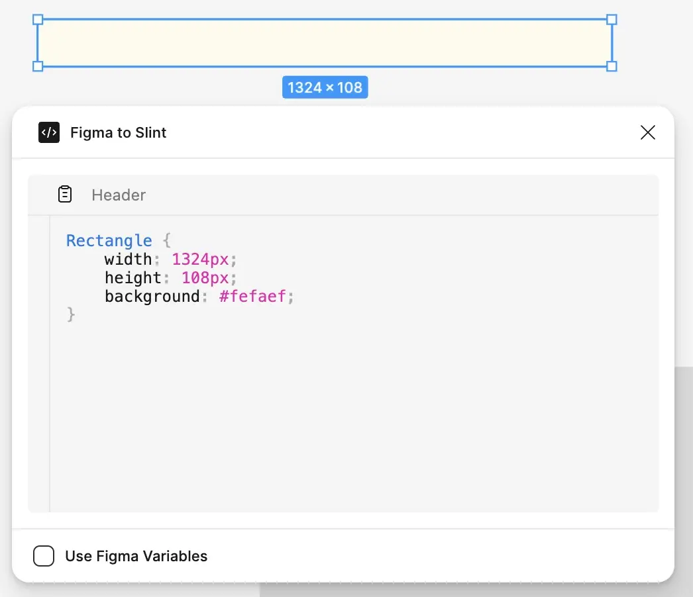
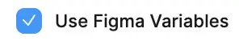
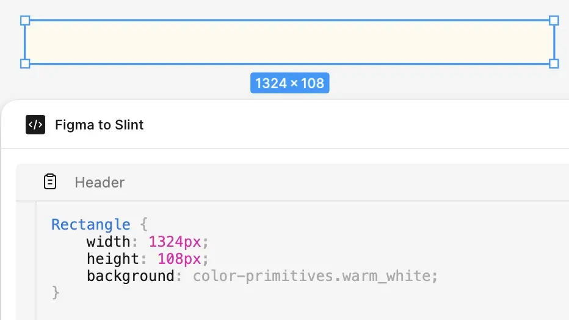
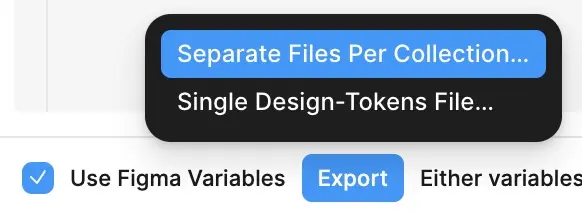

import { Tabs, TabItem } from '@astrojs/starlight/components';
import LangRefLink from '@slint/common-files/src/components/LangRefLink.astro';

## 简介

"Figma to Slint" 插件弥合了 Figma 设计与 Slint 用户界面之间的差距。它提供两大功能：

1.  **对象检查：** 允许开发者选择 Figma 画布上的任意对象，并查看其属性（如尺寸、颜色、字体等），这些属性会格式化为 Slint 代码片段。这对于快速将视觉设计元素转换为 Slint 代码很有用。与变量导出配合使用时，如果 Figma 文件中使用了变量，该功能会将变量插入到代码中。
2.  **变量导出：** 能够将 Figma 中定义的设计令牌（颜色、数字、字符串和布尔值的变量）可靠地直接导出到 `.slint` 文件中。此功能完全支持 Figma 的模式，允许实现可换肤的设计（例如浅色和深色模式），并生成必要的 Slint 结构体、枚举和全局实例，以便在你的 Slint 应用程序中无缝使用这些令牌。

## 设置 Figma Inspector

首先，在 Figma 插件管理器中找到并启用 "Figma to Slint" 插件。
该检查器目前有 2 个功能。一个是检查单个 Figma 对象的属性，另一个是导出 Figma 中定义的变量，以便直接在 Slint 中使用。

## 变量导出的主要特性

- **类型转换：**

  该插件将 Figma 变量类型映射到对应的 Slint 类型，如下所示：

  | Figma 变量类型 | Slint 类型 |
  | -------------- | ---------- |
  | Color          | `brush`    |
  | Float          | `length`   |
  | String         | `string`   |
  | Boolean        | `bool`     |

- **模式支持：**
  对于一个 Figma 文件，其中 Mode `MyCollection` 具有 `light` 和 `dark` 模式，导出器将为模式选择创建一个 Slint `enum`（例如 `MyCollectionMode { light, dark }`）。
  该文件还包含一个表示变量结构的 `Scheme` 结构体（`MyCollection-Scheme`）。一个 `Scheme-Mode` 结构体（`MyCollection-Scheme-Mode`）为每个模式保存 `Scheme` 的实例。最后还有一个全局实例（`my_collection`），其中包含：- `mode`：一个 `Scheme-Mode` 实例，保存每个模式解析后的值。- `current-mode`：一个 `in-out` 属性，使用模式 `enum` 控制活动模式。- `current`：一个 `out` 属性，根据 `current-mode` 动态选择正确的 scheme 实例。
- **可靠的变量解析：** 自动将所有变量别名（引用）解析为其具体值，确保无论变量之间如何相互引用，输出都保持一致且可预测。
- **层级生成：** 将 Figma 中的 `/` 例如
  `colors/background/primary`
  解释为生成嵌套的 Slint 结构体，使相应变量在 Slint 中按点表示法嵌套，因此上述示例会转换为 `colors.background.primary`
- **稳健的模式处理：** 智能匹配 Figma 模式，确保所有变量都以其正确的值导出，即使集合与变量之间的模式 ID 无法完全匹配。
- **名称清理：** 清理集合、变量和模式名称，使其成为合法的 Slint 标识符（例如将空格和特殊字符转换为下划线，处理前导数字）。
- **导出选项：**
  - **单独文件：** 将每个 Figma 集合导出到各自的 `.slint` 文件。生成 `<collection_name>.slint` 文件，并在需要时自动进行跨集合导入。
  - **单文件：** 将所有集合合并到单个 `design-tokens.slint` 文件中，便于项目集成。
- **README 生成：** 在导出时同时生成一个 `README.md` 文件，总结导出的集合、重命名的变量以及任何警告。

## 用法

1.  **检查器：**
    - 打开插件 UI，选择你想检查的任意对象。
      

2.  **变量：**
    - 要查看和导出变量，请在插件 UI 中勾选 "Use Figma Variables" 复选框。
      
    - 现在选择要检查的对象时，你应该会看到变量名称而不是解析后的值（如果它们已被赋值）
      
3.  **导出：** 点击 "Export" 按钮并选择：
    
    - `Separate Files Per Collection…`：推荐用于组织管理。生成 `<collection_name>.slint` 文件。
    - `Single Design-Tokens File…`：生成 `design-tokens.slint`，便于项目集成。
4.  **集成：**
    - 将生成的 `.slint` 文件放入你的 Slint 项目中。

## 设计令牌文件结构

1. **导入**

   ```slint no-test
   // If separate files:
   import { Colors } from "colors.slint";
   import { Spacing } from "spacing.slint";
   ```

   ```slint no-test
   // If single file:
   import { Colors, Spacing } from "design-tokens.slint";
   ```

2. **使用变量**

   ```slint no-test
   // Use the tokens:
   export component MyComponent inherits Rectangle {
       background: Colors.current.background.primary; // Access via .current for mode switching
       height: Spacing.medium; // Access directly if single-mode or not mode-dependent
   }
   ```

3. **模式切换：**（用于多模式集合）
   修改导入的全局的 `current-mode` 属性：

   ```slint no-test
   // Example: In your main component's logic
   init => {
       // Set initial mode
       Colors.current-mode = ColorsMode.dark;
   }
   // Or in response to a user action:
   clicked => {
       Colors.current-mode = (Colors.current-mode == ColorsMode.light) ? ColorsMode.dark : ColorsMode.light;
   }
   ```

   - 通过 `<collection_name>.current.*` 访问的所有属性都会自动更新。

## 命名约定与清理

- **层级：** Figma 在变量名称中使用 `/`（例如 `radius/small`、`font/body/weight`）。导出时会利用它们创建嵌套的 Slint 结构体，使代码补全更清晰。
- **清理：** 集合名称、变量名称（路径段）和模式名称会被自动清理：
  - 空格和非法字符（`&`、`+`、`:`、`-` 等）通常会在集合/结构体名称中转换为 `-`，在属性/枚举名称中转换为 `_`。
  - 移除开头/结尾的非法字符。
  - 以数字开头的名称会加上 `_` 或 `m_` 前缀。
  - 集合根层级中任何名称恰好为 `mode` 的变量，在 Slint 输出中会重命名为 `mode-var`，以避免与生成的 scheme `mode` 属性冲突。

  #### 示例

  集合 `Color Primitives` 中的变量 `Color & Shade (only #hex values)`
  会被转换成
  `color-primitives.color_and_shade_only_hex_values`
