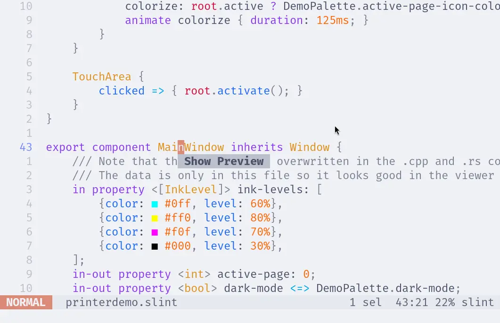

{/* cSpell: ignore Textobject */}

import Link from '@slint/common-files/src/components/Link.astro';

要安装 Slint Language Server，请查看 <Link type="SlintLSP" label="LSP 文档"/>。

[Helix](https://helix-editor.com/) 开箱即用，无需进一步配置。要检查 Helix 是否成功检测到 Slint Language Server，请运行以下命令：

```sh
hx --health slint
```

输出应类似：

```
Configured language servers:
  ✓ slint-lsp: /home/user/.local/bin/slint-lsp
Configured debug adapter: None
Configured formatter: None
Highlight queries: ✓
Textobject queries: ✓
Indent queries: ✓
```

### 实时预览

要打开实时预览，请将光标放在组件名称上并触发代码操作（默认绑定到 `<space>a`）。
根据你的配置，此操作可能绑定到其他按键，因此请检查你的配置以找到合适的按键绑定（`code_action`）。


