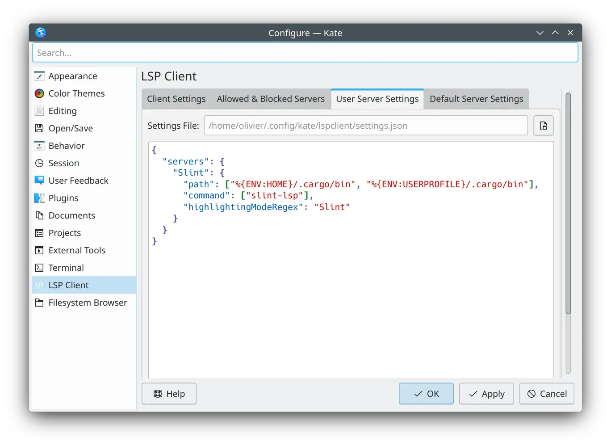

{/* cSpell: ignore ksyntaxhighlighter */}

import Link from '@slint/common-files/src/components/Link.astro';

在开始之前，有一点很重要：Kate 使用 LSP 依赖语法高亮文件的存在。
因此，我们先设置语法高亮。

### 语法高亮

自 KDE Frameworks 6.27 起，Kate 内置支持高亮 Slint 文件。当前 Frameworks 版本可在 "Help" -> "About Kate" 菜单下查看。由于此版本在撰写本文时较新，你仍然可以在下方找到手动安装说明。

需要将高亮语法文件复制到 Kate 能够找到的位置。更多信息请参阅 [Kate 文档](https://docs.kde.org/stable_kf6/en/kate/katepart/highlight.html#katehighlight-xml-format)。

在 Linux 上，可以通过运行以下命令完成

```sh
mkdir -p ~/.local/share/org.kde.syntax-highlighting/syntax/
wget https://invent.kde.org/frameworks/syntax-highlighting/-/raw/master/data/syntax/slint.xml -O ~/.local/share/org.kde.syntax-highlighting/syntax/slint.xml
```

在 Windows 上，将 [slint.xml](https://invent.kde.org/frameworks/syntax-highlighting/-/raw/master/data/syntax/slint.xml) 下载到 `%USERPROFILE%\AppData\Local\org.kde.syntax-highlighting\syntax`

### LSP

设置好语法高亮后，你现在可以安装 Slint Language Server。请查看 <Link type="SlintLSP" label="LSP 文档"/> 了解说明。

安装完成后，转到 _Settings > Configure Kate_。在 _Plugins_ 部分启用 _LSP-Client_ 插件。这会在设置对话框中添加一个 _LSP Client_ 部分。在该 _LSP Client_ 部分中，转到 _User Server Settings_，并在文本区域中输入以下内容：

```json
{
  "servers": {
    "Slint": {
      "path": ["%{ENV:HOME}/.cargo/bin", "%{ENV:USERPROFILE}/.cargo/bin"],
      "command": ["slint-lsp"],
      "highlightingModeRegex": "Slint"
    }
  }
}
```



### 实时预览

LSP 正确设置后，要预览组件，首先将光标定位在你想预览的组件的名称定义上
（例如 `component MainWindow inherits Window {` 中的 `MainWindow`）。
然后激活 _Show Preview_ 代码操作。
你可以使用 Alt+Enter 快捷键调出代码操作菜单，
或在菜单栏的 _LSP Client > Code Action > Show Preview_ 中找到它
