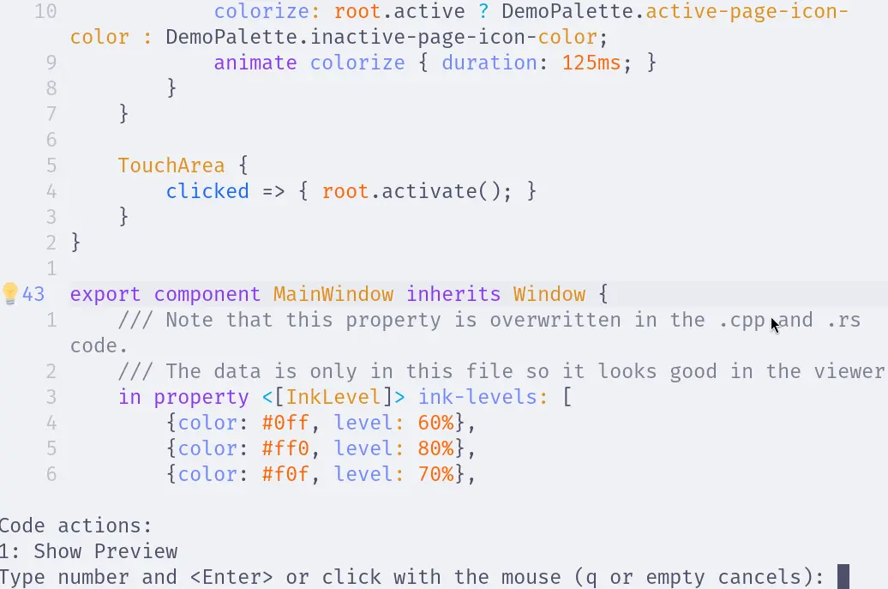
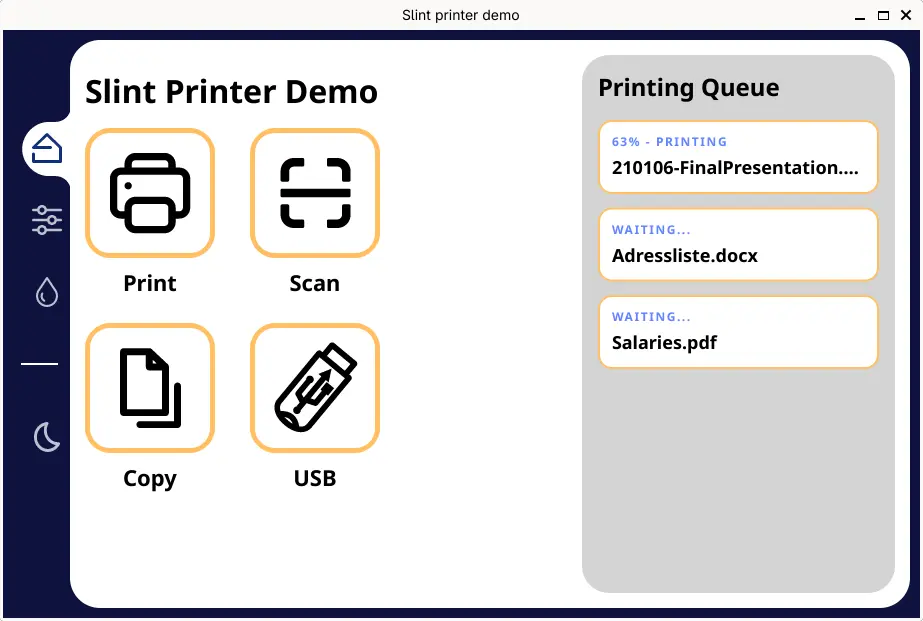

import Link from '@slint/common-files/src/components/Link.astro';

我们为不同的编辑器提供扩展或配置文件，以更好地支持 .slint 文件。

<a id="editors"></a>

### 编辑器

- <Link type="VSCode" label="Visual Studio Code" />
- <Link type="Kate" />
- <Link type="QtCreator" label="Qt Creator" />
- <Link type="Helix" />
- <Link type="NeoVim" label="(Neo-)Vim" />
- <Link type="SublimeText" label="Sublime Text" />
- <Link type="JetBrains" label="JetBrains IDE" />
- <Link type="Zed" />

如果你最喜欢的编辑器不在受支持编辑器的列表中，这仅仅意味着我们没有测试过它，并不代表它无法使用。我们确实为 Slint 提供了一个语言服务器，它应该能与大多数支持 Language Server Protocol (LSP) 的编辑器配合使用。如果你确实用它测试了你的编辑器，我们很乐意接受在此处添加说明的拉取请求。

## <a name="slint-lsp"/>Slint Language Server (`slint-lsp`)

大多数现代编辑器使用 [Language Server Protocol (LSP)](https://microsoft.github.io/language-server-protocol/) 来添加对不同编程语言的支持。
Slint 通过 `slint-lsp` 二进制文件提供了一个 LSP 实现。

### 安装

有多种方式安装 `slint-lsp`：

#### 使用预构建二进制文件（通过 `cargo binstall`）：

安装 `slint-lsp` 最快的方式是使用 [cargo binstall](https://github.com/cargo-bins/cargo-binstall)，它会自动下载并安装预构建的二进制文件：

```sh
cargo binstall slint-lsp
```

#### 从源码：

如果你安装了 Rust 工具链，请使用 `cargo install`：

```sh
cargo install slint-lsp
```

从 git 仓库安装开发版本：

```sh
cargo install slint-lsp --git https://github.com/slint-ui/slint --force
```

确保找到了所需的依赖。在类 Debian 系统上，使用以下命令安装它们：

```shell
sudo apt install -y build-essential libx11-xcb1 libx11-dev libxcb1-dev libxkbcommon0 libinput10 libinput-dev libgbm1 libgbm-dev
```

#### 使用预构建二进制文件（手动下载）：

你也可以从 Slint GitHub releases 页面下载预构建的二进制文件：

1. 转到 [最新的 Slint 版本](https://github.com/slint-ui/slint/releases/latest)
2. 从 "Assets" 下载适合你架构的 `slint-lsp-*` 压缩包，例如：
   - Linux x86-64：[`slint-lsp-x86_64-unknown-linux-gnu.tar.gz`](https://github.com/slint-ui/slint/releases/latest/download/slint-lsp-x86_64-unknown-linux-gnu.tar.gz)。
   - Windows x86-64：[`slint-lsp-x86_64-pc-windows-msvc.zip`](https://github.com/slint-ui/slint/releases/latest/download/slint-lsp-x86_64-pc-windows-msvc.zip)。
   - Mac（Intel 与 Apple Silicon）[`slint-lsp-universal-apple-darwin.tar.gz`](https://github.com/slint-ui/slint/releases/latest/download/slint-lsp-universal-apple-darwin.tar.gz)。
   - Linux 和 Windows 上还有 ARM 二进制文件（分别命名为 aarch64 或 armv7）。
3. 将下载的压缩包解压到你选择的位置（最好放在 PATH 中的某个位置，以便在命令行中可用）。

### 编辑器配置

安装好 `slint-lsp` 后，配置你的编辑器以使用该二进制文件，无需任何参数。
详情请参阅我们的[编辑器配置列表](#editors)。
如果你的编辑器不在此列表中，请参考你的编辑器文档，了解如何设置语言服务器。

### <a name="fmt"/>格式化 Slint 文件

Slint 文件可以通过 `slint-lsp` 按以下方式自动格式化：

- `slint-lsp format <path>` - 读取文件并将格式化后的版本输出到 stdout
- `slint-lsp format -i <path>` - 读取文件并将输出保存到同一文件
- `slint-lsp format /dev/stdin` - 使用 /dev/stdin 你可以实现从
  stdin 读取并写入 stdout 的特殊行为

注意，`.slint` 文件会被格式化，而 `.md` 和 `.rs` 文件中会搜索 `.slint` 代码块。
所有其他文件都保持不变。

如果你在编辑器中配置了 `slint-lsp`，你也应该能够通过编辑器格式化 .slint 文件。

## Slint 实时预览 (`slint-viewer`)

Slint 的实时预览功能让你实时看到代码更改。
这是无需重新编译即可快速迭代 UI 的非常强大的方式。

如果你在编辑器中配置了 slint-lsp，你可以直接从编辑器启动实时预览。

**Neovim 中的示例：**



### 从终端运行 `slint-viewer`

要从终端打开实时预览，请运行 `slint-viewer --auto-reload <path/to/file.slint>`。
安装、截图以及所有命令行选项请参阅 <Link type="SlintViewer" label="Slint Viewer"/> 页面。

**[Printer Demo](https://github.com/slint-ui/slint/blob/master/demos/printerdemo/ui/printerdemo.slint) 示例**



## 其他资源

- [Slint Plugin for (Neo)vim](https://github.com/slint-ui/vim-slint)
- [Slint TreeSitter Grammar](https://github.com/slint-ui/tree-sitter-slint)
- [Editor Configuration Source](https://github.com/slint-ui/slint/tree/master/editors)
