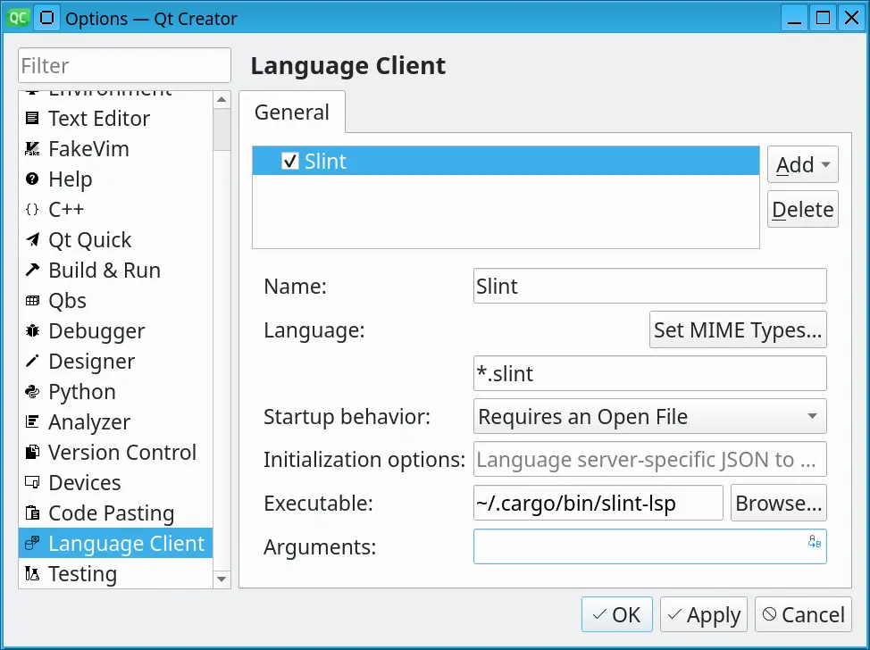

import Link from '@slint/common-files/src/components/Link.astro';

### 语法高亮

Qt Creator 支持与 Kate 相同的格式。请参考 <Link type="KateSyntaxHighlighting" label="Kate"/> 的说明来设置语法高亮。

### LSP

要安装 Slint Language Server，请查看 <Link type="SlintLSP" label="LSP 文档"/>。

要设置 LSP：

1.  安装 `slint-lsp` 二进制文件
2.  然后在 Qt creator 中，转到 _Tools > Option_ 并选择 _Language Client_ 部分。
3.  点击 _Add_
4.  名称使用 "Slint"
5.  文件模式使用 `*.slint`。（不要使用 MIME 类型）
6.  作为可执行文件，选择 `slint-lsp` 二进制文件（无需参数）
7.  点击 _Apply_ 或 _Ok_

### 实时预览

设置好 LSP 后，要**预览组件**，请在打开 .slint 文件时，将光标放在
你想预览的组件名称上，然后按 _Alt + Enter_ 打开
代码操作菜单。从该菜单中选择 _Show Preview_。
