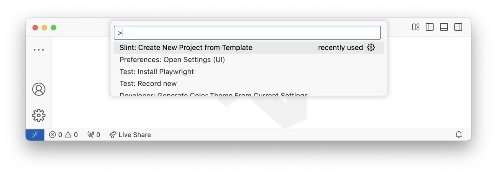
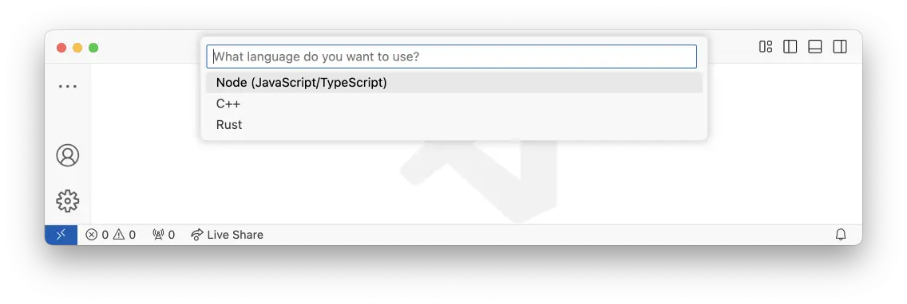
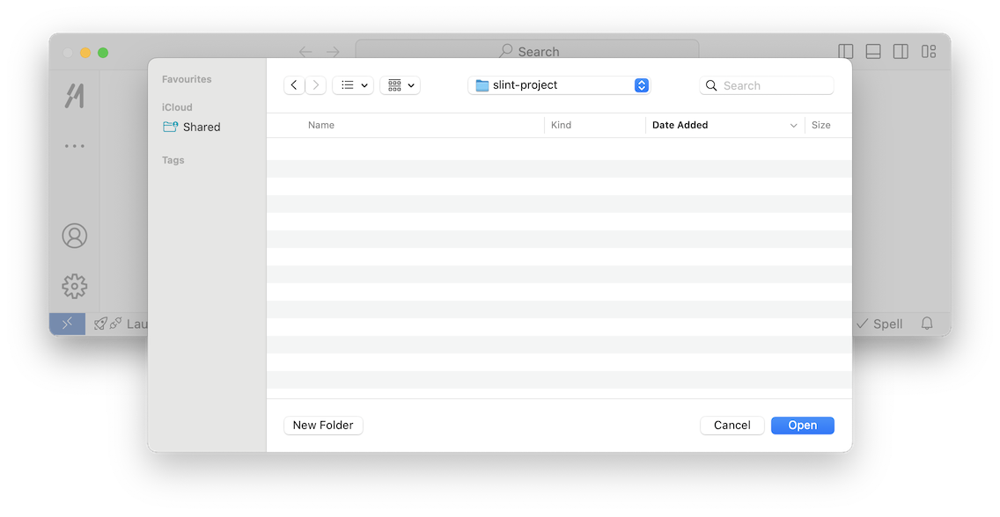

{/* cSpell: ignore Wwctiow */}

import { Steps, Tabs, TabItem } from '@astrojs/starlight/components';
import Link from '@slint/common-files/src/components/Link.astro';

Visual Studio Code (VS Code) 的 Slint 扩展为你提供语法高亮、补全、诊断、
UI 实时预览，以及从模板创建新项目的命令。
本页展示如何安装它并从模板创建项目。

:::note[注意]
我们还支持许多其他工具和编辑器，请参见<Link type="ManualEditorSetup" label="此处"/>。
:::

## 设置 VS Code

<Steps>

1. **安装 VS Code。**
   在[此处](https://code.visualstudio.com)下载。

2. **安装 Slint 扩展。**
   在[此处](https://marketplace.visualstudio.com/items?itemName=Slint.slint)找到它。

3. **基于 Slint 模板创建新项目。**
   通过命令面板（CTRL+Shift+P）或在 MacOS 上（CMD+Shift+P）完成。
   
   开始输入 'slint'，然后从选项中选择 'Slint: Create New Project from Template'。
4. **选择你的语言。**
   
   然后从语言列表中选择。

5. **选择保存项目的文件夹。**
   

6. **为项目命名。**
   为项目命名，然后会在所选文件夹中基于一个简单的模板创建一个新项目，
   帮助你快速上手。

</Steps>
